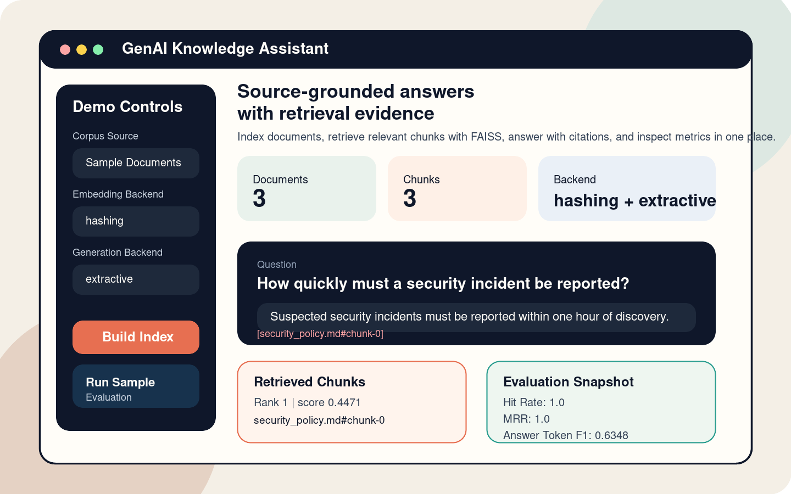
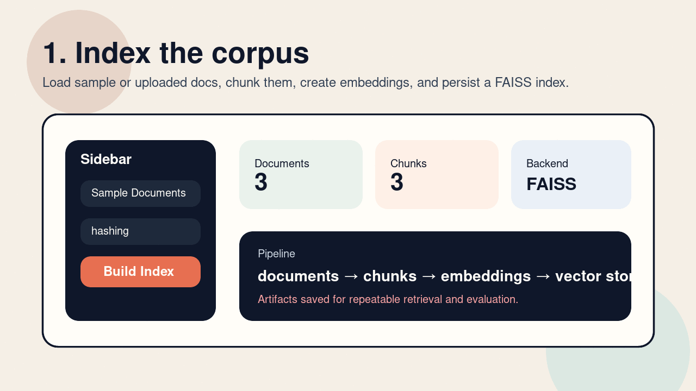

# GenAI Knowledge Assistant

[](./pyproject.toml)
[](./streamlit_app.py)
[](./app/vector_store.py)
[](https://ai.google.dev/gemini-api/docs/pricing)
[](./LICENSE)

A source-grounded Retrieval Augmented Generation (RAG) system that indexes local documents, retrieves relevant chunks with FAISS, and answers questions with citations using Gemini, OpenAI, or an offline extractive fallback.



## Why this project

This project maps directly to the resume story:

- Built a Retrieval Augmented Generation system that answers queries using document context and LLM reasoning.
- Implemented embedding pipelines, vector search indexing, and prompt engineering for better relevance.
- Reduced hallucinations through source-grounded context injection and citation validation.
- Evaluated answer quality and retrieval performance with automated metrics.

## Demo Walkthrough



## Features

- Document ingestion for `md`, `txt`, and `pdf` files.
- Configurable chunking and embedding pipelines.
- FAISS-backed vector retrieval with persisted index artifacts.
- Gemini-backed generation via `google-genai`.
- OpenAI-backed generation using the current `responses.create(...)` API.
- Offline `hashing` + `extractive` mode for stable local demos without API spend.
- Citation checks and grounding fallbacks to reduce unsupported answers.
- Built-in evaluation for token-overlap answer quality and retrieval metrics.
- Streamlit UI for live showcasing and CLI commands for reproducible testing.

## Architecture

```text
documents -> chunking -> embeddings -> FAISS index -> top-k retrieval
                                              |
                                              v
                              prompt construction + source citations
                                              |
                                              v
                          grounded answer generation + validation
                                              |
                                              v
                           evaluation: F1, hit rate, recall, MRR
```

## Tech Stack

- Python
- Gemini API
- OpenAI API
- FAISS
- Streamlit
- NumPy
- PyPDF

## Quick Start

```bash
python3 -m venv .venv
source .venv/bin/activate
pip install -e .[dev]
cp .env.example .env
```

Low-cost defaults in `.env.example`:

- `EMBEDDING_BACKEND=hashing`
- `GENERATION_BACKEND=gemini`
- `GENERATION_MODEL=gemini-2.5-flash`

If you want Gemini-backed generation, add your key to `.env`:

```bash
GEMINI_API_KEY=your_key_here
```

If you want OpenAI-backed embeddings or generation instead:

```bash
OPENAI_API_KEY=your_key_here
```

## Launch the Streamlit UI

```bash
streamlit run streamlit_app.py
```

Open `http://localhost:8501`.

Recommended live demo settings:

- `Corpus Source`: `Sample Documents`
- `Embedding Backend`: `hashing`
- `Generation Backend`: `gemini` or `extractive`
- `Strict Grounding`: enabled

Recommended public resume deployment:

- `hashing + extractive` if you want zero API cost.
- `hashing + gemini` if you want better generated answers with free-tier Gemini usage.

## CLI Usage

Index the bundled sample corpus:

```bash
rag-assistant index --embedding-backend hashing
```

Ask a question with Gemini:

```bash
rag-assistant ask \
  --question "How quickly must a security incident be reported?" \
  --embedding-backend hashing \
  --generation-backend gemini
```

Ask a question with guaranteed zero API usage:

```bash
rag-assistant ask \
  --question "How quickly must a security incident be reported?" \
  --embedding-backend hashing \
  --generation-backend extractive
```

Run the evaluation suite:

```bash
rag-assistant evaluate --embedding-backend hashing --generation-backend extractive
```

Run tests:

```bash
pytest -q
```

## Azure Deployment

This app is prepared for Azure App Service deployment with:

- [`requirements.txt`](./requirements.txt)
- [`startup.sh`](./startup.sh)
- [`AZURE_APP_SERVICE.md`](./AZURE_APP_SERVICE.md)

The deployed URL will look like:

`https://<your-app-name>.azurewebsites.net`

Recommended Azure mode for a resume link:

- `EMBEDDING_BACKEND=hashing`
- `GENERATION_BACKEND=gemini`

If you want zero billing risk, use:

- `EMBEDDING_BACKEND=hashing`
- `GENERATION_BACKEND=extractive`

## Showcase Flow

Use this sequence in an interview or portfolio walkthrough:

1. Build the index from the sample corpus and explain chunking plus vector search.
2. Ask a supported question and point out the cited source id.
3. Open the retrieved chunks panel to show why the answer is grounded.
4. Ask an unsupported question to show the fallback behavior.
5. Run the sample evaluation and talk through hit rate, reciprocal rank, and answer F1.

Good demo questions:

- `How many remote days are allowed per week?`
- `When is manager pre-approval required for an expense?`
- `How quickly must a security incident be reported?`
- `What is the dress code?`

## Example Evaluation Output

The bundled offline evaluation currently produces:

- `average_answer_token_f1`: `0.6348`
- `average_retrieval_hit_rate`: `1.0`
- `average_mean_reciprocal_rank`: `1.0`

This report is written to [`data/index/evaluation_report.json`](./data/index/evaluation_report.json) after running `rag-assistant evaluate`.

## Key Files

- [`streamlit_app.py`](./streamlit_app.py): Streamlit demo UI
- [`AZURE_APP_SERVICE.md`](./AZURE_APP_SERVICE.md): Azure deployment guide
- [`startup.sh`](./startup.sh): Azure App Service startup script
- [`app/cli.py`](./app/cli.py): CLI entrypoint
- [`app/rag.py`](./app/rag.py): retrieval plus grounded generation pipeline
- [`app/embeddings.py`](./app/embeddings.py): Gemini, OpenAI, and offline embedding backends
- [`app/vector_store.py`](./app/vector_store.py): FAISS index persistence and search
- [`app/validation.py`](./app/validation.py): prompt and citation validation
- [`app/evaluation.py`](./app/evaluation.py): answer and retrieval scoring

## License

This project is licensed under the [MIT License](./LICENSE).
